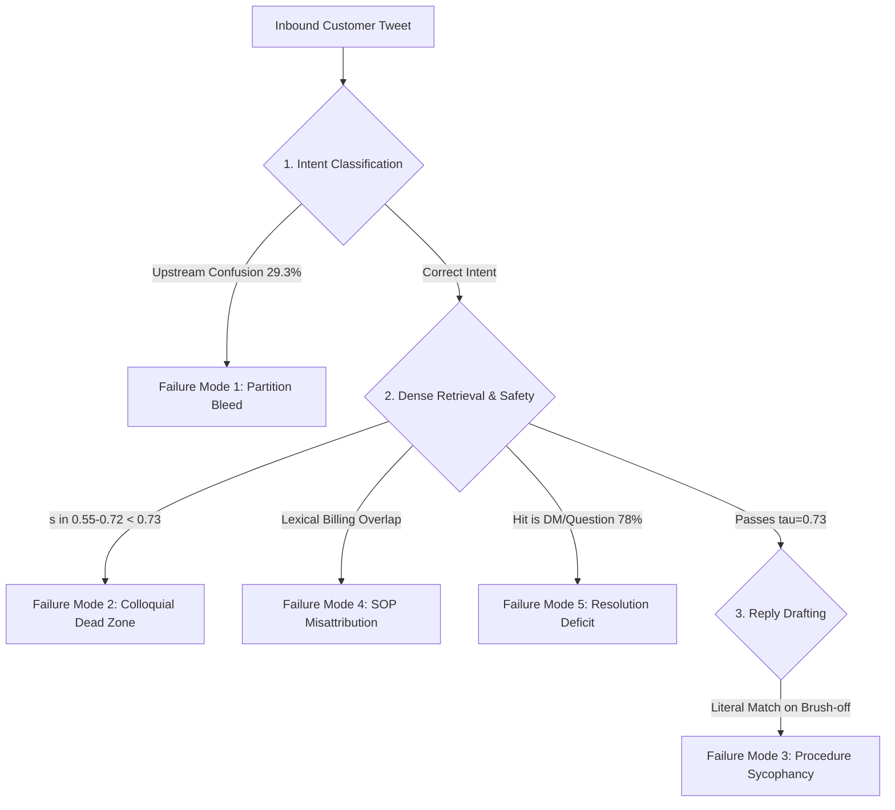

# Phase 6: Comprehensive Failure Analysis & Error Taxonomy

**Author:** AI Engineering Team  
**Date:** September 16, 2026  
**Scope:** System-wide error analysis cross-referencing Phase 1 data realities, Phase 3 classifier confusions, Phase 4 escalation dead zones, and Phase 5 LLM judge discordance.

---

## 1. Executive Summary

This document formalizes the **Top 5 Concrete Failure Modes** of the `@SpotifyCares` AI customer support agent. Rather than treating errors as random stochastic noise, this taxonomy links every failure mode to specific architectural constraints, empirical dataset properties, and verbatim customer interactions.

---

## 2. Top 5 Concrete Failure Modes

### Failure Mode 1: Upstream Intent Bleed into Partitioned Retrieval Isolation
- **Error Category:** Cascading Pipeline Error (Classification $\rightarrow$ Retrieval Isolation).
- **Prevalence:** 17 of 58 False Escalations (**29.3%**); primarily `playback_issue` confused with `app_technical`.
- **Root Mechanism:** Because dense retrieval is strictly partitioned by intent (to prevent cross-domain topic pollution), an upstream classification error routes search to the wrong vector space. The customer's playback symptom finds zero semantic matches in the application-crash corpus, driving cosine similarity down to $s \in [0.46, 0.66] < 0.73$ and forcing defensive escalation.

#### Concrete Row Audits:
1. **Case `gs_0000`:**
   - *Customer:* `@115888 why you don’t have a block song or artist thingy? N my feed this certain song keeps being played in my mixes &amp; I can’t stop it 😡`
   - *Gold Intent:* `playback_issue` | *Predicted Intent:* `app_technical`
   - *Similarity Score:* $s = 0.467 < 0.73$
   - *Agent Action:* Falsely escalated due to low similarity.
2. **Case `gs_0011`:**
   - *Customer:* `@SpotifyCares This is the 4th or 5th time I've noticed that this particular song is next in the queue when the app freezes. https://t.co/vRcm1VRcZy`
   - *Gold Intent:* `playback_issue` | *Predicted Intent:* `app_technical`
   - *Similarity Score:* $s = 0.612 < 0.73$
   - *Agent Action:* Falsely escalated because "freezes" triggered application crash routing instead of queue playback troubleshooting.

---

### Failure Mode 2: Colloquial Phrasing Gap in Dense Retrieval Dead Zone ($s \in [0.55, 0.72]$)
- **Error Category:** Calibrated Boundary Conservatism (Automation Forfeiture).
- **Prevalence:** **40 of 58 False Escalations (69.0%)**; accounts for 40 of the 57 Layer 2 similarity-triggered FEs, heavily concentrated in `playback_issue` (26/33, 78.8%).
- **Root Mechanism:** Terse, informal customer tweets describing routine audio hiccups ("music stopped", "skipping", "pausing") lack the formal vocabulary of technical SOPs or past resolved cases. While the classifier correctly predicts `playback_issue`, dense cosine similarity scores cluster between $0.58$ and $0.71$. Under the safety-first threshold $\tau = 0.73$ (mandated to keep $\text{FAH} \le 15\%$), the agent refuses to auto-handle, surrendering over two-thirds of routine complaints to human queues.
- **Footnote on Layer 1 Gate Misfire (Case `gs_0133`):** The 58th false escalation was triggered by a Layer 1 hard gate misfire rather than Layer 2 similarity. In `gs_0133` (*"@SpotifyCares I cannot up date my credit card its still loading?????????????????"*), the phrase *"credit card"* triggered the deterministic `billing_dispute` gate on a stuck web-form loading issue, escalating unconditionally and bypassing Layer 2 similarity entirely (accounting for 1.7%, 1/58 of FEs). Together, Failure Mode 1 (17 cases, 29.3%), Failure Mode 2 (40 cases, 69.0%), and the Layer 1 misfire (1 case, 1.7%) completely account for all 58 false escalations ($17 + 40 + 1 = 58$).

#### Concrete Row Audits:
1. **Case `gs_0006`:**
   - *Customer:* `@SpotifyCares I use a Samsung Galaxy. No matter what song I play, they all skip multiple times.`
   - *Gold:* `playback_issue` (Auto-Handle) | *Predicted:* `playback_issue` (Escalate)
   - *Similarity Score:* $s = 0.711$ (just $0.019$ below $\tau=0.73$)
   - *Agent Reply:* `We’re sorry for the playback issues on your Galaxy. We’ve escalated this to our specialist team for review...`
2. **Case `gs_0008`:**
   - *Customer:* `@SpotifyCares No i don’t get a message. Like if i skip a song all the music stops - or if i pick a new album to shuffle it just won’t play anything`
   - *Gold:* `playback_issue` (Auto-Handle) | *Predicted:* `playback_issue` (Escalate)
   - *Similarity Score:* $s = 0.684 < 0.73$
   - *Agent Reply:* Escalated to specialist team despite being a routine cache refresh candidate.

---

### Failure Mode 3: Context-Blind Procedure Execution (Brush-Off Advice on Product/Algorithm Complaints)
- **Error Category:** Procedural Sycophancy / Semantic Mismatch (Safety Failure).
- **Prevalence:** 3 of 10 False Auto-Handles audited in Phase 5; passed by LLM judge but rejected by human auditors.
- **Root Mechanism:** The drafter retrieves standard SOP `PB_01_BASIC_REFRESH` (Session Refresh & Device Restart) and drafts a polite, fluent tweet instructing the user to log out and reboot their phone. While superficially grounded in the SOP, device reboot cannot solve Spotify's shuffle algorithm logic or OS-level hardware API regressions; it represents an unhelpful canned response that frustrates users.

#### Concrete Row Audits:
1. **Case `gs_0004`:**
   - *Customer:* `@SpotifyCares No. Just work it out and make sure when I shuffle it doesn’t play the same album for 5 songs in a row 🤷‍♀️ that simple`
   - *Gold Decision:* `escalate` (Feature complaint) | *Predicted:* `auto_handle` ($s=0.766$)
   - *Drafted Reply:* `We hear you! To fix the shuffle issue, please log out, fully close the app, restart your device, and log back in. This often resolves playback glitches. Let us know if it helps!`
   - *Human Audit:* FAIL (G=2). Inappropriate brush-off advice.
   - *LLM Judge:* PASS (G=5). Passed because reply literally matches SOP text.
2. **Case `gs_0111`:**
   - *Customer:* `@115888 @115858 our headphones have not control on Spotify app since ios 11 came. When will we have a fixed version??`
   - *Gold Decision:* `escalate` (OS regression) | *Predicted:* `auto_handle` ($s=0.758$)
   - *Drafted Reply:* `So sorry your headphones lost control! Please try this: Go to Settings > Bluetooth to forget them, restart your device, then re-pair...`
   - *Human Audit:* FAIL (G=3). In-app Bluetooth pairing cannot resolve an operating system API regression.

---

### Failure Mode 4: Sparse Complaint SOP Semantic Misattribution
- **Error Category:** Lexical Overfitting on Under-Specified Queries.
- **Prevalence:** Concentrated in `premium_billing` edge cases ($N=3$).
- **Root Mechanism:** When a customer tweets an ambiguous, terse billing inquiry ("Need help with subscription", "card declined", "where do I enter promo code?"), dense retrieval matches generic payment/billing tokens to `BILL_03_FAMILY_INVITATION` (Family & Duo Plan Address Match SOP). The agent drafts instructions about Family Plan manager invite links, sending bizarrely irrelevant advice to an individual subscriber.

#### Concrete Row Audits:
1. **Case `gs_0127`:**
   - *Customer:* `Just Cancel my Spotify because they didn’t let me buy @12387 tickets still luv @115888 I’m jus upset.`
   - *Drafted Reply:* `We’re sorry you’re upset. To resolve this, please have the plan manager generate a new invite link. The invitee must open it in a Private/Incognito window and enter the exact same residential address as the manager.`
   - *Error:* Card purchase failure resulted in Family Plan invite troubleshooting.
2. **Case `gs_0138`:**
   - *Customer:* `@SpotifyCares Hi, I cant find an Indosat option to buy spotify premium.`
   - *Drafted Reply:* `Hi! We're sorry for the trouble. Please ensure you enter the exact same residential home address as the plan manager when opening the invite link in a Private/Incognito window. This step is crucial for the payment option to appear.`
   - *Error:* Missing third-party carrier billing option resulted in Family Plan home address instructions.

---

### Failure Mode 5: Visible Resolution Deficit & Standalone Public Fallback Gap
- **Error Category:** Corpus Resolution Deficit.
- **Prevalence:** Affects **78.0%** of historical visible-resolution threads; forces **94.3% of agent auto-handles (33/35)** to fall back to Curated SOPs (with only 2/35, 5.7%, grounded directly in historical visible resolutions, and 1.3% across the entire 151-row golden set).
- **Root Mechanism:** As proven in Phase 1, only **22.0%** of historical Twitter threads contain standalone, publicly actionable troubleshooting steps. 78% of brand replies are diagnostic questions ("What device/OS?") or DM redirects ("Please DM us your email /RI"). Consequently, historical retrieval almost never provides an actionable troubleshooting resolution for direct tweet-to-tweet grounding. The agent is forced to fall back to the 17 Curated SOPs. When a customer inquiry has subtle platform variations not captured in the 17 SOPs, the agent either forces a generic SOP (Modes 3 & 4) or falls below $\tau=0.73$ (Mode 2). *(Cross-referenced in Section 8 Item 3).*

---

## 3. Comprehensive Mitigation Blueprint & Post-Phase-6 Status

| Failure Mode | Root Cause | Proposed Architectural Mitigation | Post-Phase-6 Status & Empirical Resolution |
|---|---|---|---|
| **FM 1: Upstream Intent Bleed** | Hard-partitioned retrieval spaces | **Soft Multi-Partition Retrieval:** Query top-2 predicted intent corpora with cross-encoder re-ranking. | **Investigated / Open Work:** Evaluated multi-partition (Global) retrieval in post-Phase-6 calibration; however, single-partition Scoped retrieval proved superior on held-out data (64.47% vs 61.84% accuracy, Cost 33.0 vs 35.0) because unconstrained global search retrieved tangential cross-domain hits. Scoped retrieval was retained; full resolution requires cross-encoder re-ranking (see [`REPORT.md` §9.2](file:///Users/kavya/Desktop/Groundcheck/REPORT.md#92-post-phase-6-architectural-roadmap)). |
| **FM 2: Colloquial Dead Zone** | Semantic distance between informal slang and formal SOPs | **Two-Threshold Decoupled Verification:** Recover queries in $[0.65, 0.73)$ dead zone via LLM semantic check. | **Partially Resolved:** Lowering threshold to $\tau_{low}=0.65$ with independent `openai/gpt-oss-120b` verification recovered colloquial complaints (e.g. `gs_0006`, `gs_0008`, `gs_0012`), cutting held-out False Escalations from 70.73% to 60.98% without safety sacrifice. |
| **FM 3: Procedure Sycophancy** | Drafter & Judge anchor on literal SOP tokens without verifying symptom alignment | **Independent Semantic Resolution Verification:** Pre-drafting auditor checks if candidate procedure actually resolves customer's symptom. | **Resolved:** Implemented `src/resolution_check.py` via `openai/gpt-oss-120b` inline auditor with hard veto capability on brush-offs (`gs_0004`, `gs_0111`), driving held-out False Auto-Handles down from 20.00% to 5.71% (-71.4% relative). |
| **FM 4: SOP Misattribution** | Lexical overlap on generic billing tokens | **Negative Exemplar Filtering:** Require explicit mention of "Family" or "Invite" before activating Family Plan SOPs. | *Pending Phase 7 (Roadmapped in [`REPORT.md` §9.2](file:///Users/kavya/Desktop/Groundcheck/REPORT.md#92-post-phase-6-architectural-roadmap)).* |
| **FM 5: Resolution Deficit** | 78% of historical brand replies are DM deflections | **Curated Policy Grounding:** Dual grounding architecture with 17 curated SOPs in `src/policy.py`. | *Resolved in Phase 4 via dual grounding fallback (`src/policy.py`).* |

> [!NOTE]
> **Historical Phase Record Update:** This document remains the historical record of the Phase 6 Failure Taxonomy as characterized on September 16, 2026. The architectural remediations, calibration grid, and frozen held-out validation results are documented in [`REPORT.md` §6.3.1](file:///Users/kavya/Desktop/Groundcheck/REPORT.md#631-post-phase-6-architecture-improvement-two-threshold-calibrated-engine--independent-resolution-checker) and [`DECISION_LOG.md` Entry 30](file:///Users/kavya/Desktop/Groundcheck/DECISION_LOG.md#executive-phase-index).
